# MovieTime System - C4 Architecture Diagrams

**Version:** 1.0
**Date:** February 7, 2026

This document contains C4 model architecture diagrams for the MovieTime System using Mermaid syntax.

---

## Level 1: System Context Diagram

```mermaid
graph TB
    subgraph "External Users"
        Admin[👤 Administrator<br/>Full system access]
        Operador[👤 Operador<br/>Limited access]
    end

    subgraph "MovieTime System"
        MovieTime[🎬 MovieTime PTY<br/>Subscription Management System<br/>Next.js 16 + React 19]
    end

    subgraph "External Systems"
        FirebaseAuth[🔐 Firebase Authentication<br/>User auth + roles]
        Firestore[🗄️ Firebase Firestore<br/>NoSQL database<br/>10 collections]
        WhatsApp[💬 WhatsApp Business<br/>Customer notifications]
    end

    Admin -->|Manage system| MovieTime
    Operador -->|Use system| MovieTime
    MovieTime -->|Authenticate| FirebaseAuth
    MovieTime -->|Store/Retrieve data| Firestore
    MovieTime -->|Send messages| WhatsApp

    style MovieTime fill:#4A90E2,color:#fff
    style FirebaseAuth fill:#FFA000,color:#fff
    style Firestore fill:#FFA000,color:#fff
    style WhatsApp fill:#25D366,color:#fff
```



### Context Description

**MovieTime PTY** is the central system managing streaming service subscriptions for the Panama market.

**Users:**
- **Administrators:** Full CRUD access, manage all entities
- **Operadores:** Limited access, can view and create but not delete

**External Systems:**
- **Firebase Authentication:** Email/password authentication, [TODO] Custom Claims for roles
- **Firebase Firestore:** Stores all application data (usuarios, ventas, servicios, etc.)
- **WhatsApp Business:** Sends automated expiration notifications to clients

---

## Level 2: Container Diagram

```mermaid
graph TB
    subgraph "Browser"
        Browser[🌐 Web Browser<br/>Chrome, Edge, Safari]
    end

    subgraph "Next.js Application"
        subgraph "Frontend Layer"
            AppRouter[📱 App Router<br/>React Server Components<br/>Client Components]
            Components[🧩 UI Components<br/>shadcn/ui + Custom]
            StateManagement[📦 Zustand Stores<br/>10 domain stores]
        end

        subgraph "API Layer"
            Proxy[⚡ Edge Runtime Proxy<br/>proxy.ts<br/>⚠️ TODO: JWT validation]
        end

        subgraph "Data Layer"
            FirebaseSDK[🔥 Firebase Integration<br/>Generic CRUD<br/>Pagination + Cache]
            ServiceLayer[⚙️ Service Layer<br/>Business logic<br/>metricsService<br/>ventasService]
        end
    end

    subgraph "Firebase Backend"
        Auth[🔐 Firebase Auth<br/>Email/Password]
        DB[(🗄️ Firestore<br/>10 collections)]
        Functions[☁️ Functions<br/>⚠️ TODO: Server validation]
    end

    Browser -->|HTTPS| AppRouter
    AppRouter -->|Navigate| Components
    Components -->|Read/Write state| StateManagement
    StateManagement -->|Business logic| ServiceLayer
    ServiceLayer -->|CRUD operations| FirebaseSDK
    AppRouter -->|Request| Proxy
    Proxy -->|Verify auth| Auth
    FirebaseSDK -->|Read/Write| DB
    FirebaseSDK -->|Authenticate| Auth
    Functions -.->|TODO: Validate| DB

    style AppRouter fill:#61DAFB,color:#000
    style StateManagement fill:#764ABC,color:#fff
    style FirebaseSDK fill:#FFA000,color:#fff
    style Proxy fill:#FF6B6B,color:#fff
    style Functions fill:#FFAA00,stroke-dasharray: 5 5
```

### Container Descriptions

**Frontend Layer:**
- **App Router:** Next.js 16 routing with RSC and client components
- **UI Components:** shadcn/ui (21 components) + custom feature components
- **Zustand Stores:** 10 domain-specific stores for state management

**API Layer:**
- **Edge Runtime Proxy:** Request routing and [TODO] JWT validation

**Data Layer:**
- **Firebase Integration:** Generic CRUD with automatic timestamp conversion, pagination, caching
- **Service Layer:** Business logic extracted from components (metrics, ventas operations)

**Firebase Backend:**
- **Authentication:** Email/password, [TODO] Custom Claims
- **Firestore:** 10 collections (usuarios, ventas, servicios, etc.)
- **Functions:** [TODO] Server-side validation and admin operations

---

## Level 3: Component Diagram (Frontend)


### Component Descriptions

**Routes (App Router):**
- `/login`: Authentication page (centered layout)
- `/dashboard`: Main dashboard with metrics (placeholder data)
- `/usuarios`: Unified users page with tabs (Todos/Clientes/Revendedores)
- `/ventas`: Sales management with multi-item creation
- `/servicios`: Streaming services with profile occupancy tracking
- `/notificaciones`: Expiration alerts with priority levels

**Custom Hooks (Performance Optimizations):**
- **useServerPagination:** ⭐ Cursor-based pagination, auto-resets on filter changes
- **use-ventas-por-usuarios:** ⭐ Module-level cache for secondary queries (5-min TTL)
- **useVentasMetrics:** Calculates metrics from ventas array (single-pass)

**Zustand Stores (State Management):**
- 10 domain-specific stores
- Firebase integration in all stores
- 5-minute cache with TTL
- Error handling + optimistic updates

**Firebase Layer (Data Access):**
- Generic CRUD functions with TypeScript generics
- Automatic Timestamp → Date conversion
- Pagination utilities (cursor-based)
- Count queries (free on Spark plan)

**Service Layer (Business Logic):**
- Pure functions for calculations
- Side effect handling (e.g., delete venta + update profile occupancy)
- Testable and reusable

---

## Level 4: Data Flow Diagram


### Data Flow Highlights

1. **Count queries are free** (don't cost document reads on Spark plan)
2. **Pagination fetches `pageSize + 1`** (last doc used for cursor + hasMore detection)
3. **Cursors stored in useRef** (survives re-renders, enables back navigation)
4. **Auto-reset on filter changes** (tab switches clear cursors)

---

## Performance Optimization Flow


### Performance Impact

| Metric | Before | After | Improvement |
|--------|--------|-------|-------------|
| Table data reads | 50 | 11 | **78%** |
| Metrics reads | 50 | 0 | **100%** |
| Secondary query | 50 | 5 (cached) | **90%** |
| **Total first visit** | **150** | **16** | **89%** |
| **Total cached** | **150** | **0** | **100%** |

---

## Security Architecture (Current vs Proposed)

### Current Architecture (INSECURE) 🚨

```mermaid
sequenceDiagram
    participant User
    participant Client
    participant FirebaseAuth
    participant Firestore

    User->>Client: Login (email/password)
    Client->>FirebaseAuth: signInWithEmailAndPassword()
    FirebaseAuth-->>Client: FirebaseUser

    rect rgb(255, 100, 100)
        Note over Client: ❌ Client-Side Role Assignment<br/>isAdmin = email.startsWith('admin@')
        Client->>Client: Store role in localStorage
    end

    User->>Client: Navigate to /usuarios

    rect rgb(255, 100, 100)
        Note over Client: ❌ Client-Side Route Protection<br/>Can be bypassed
        Client->>Client: if (!isAuthenticated) redirect
    end

    Client->>Firestore: getAll(usuarios)

    rect rgb(255, 100, 100)
        Note over Firestore: ❌ No Security Rules<br/>Anyone can read/write
        Firestore-->>Client: All data
    end
```



### Proposed Architecture (SECURE) ✅

```mermaid
sequenceDiagram
    participant User
    participant Client
    participant Proxy
    participant FirebaseAuth
    participant Functions
    participant Firestore

    User->>Client: Login (email/password)
    Client->>FirebaseAuth: signInWithEmailAndPassword()
    FirebaseAuth-->>Client: FirebaseUser

    rect rgb(100, 255, 100)
        Note over Client,Functions: ✅ Server-Side Role Assignment
        Client->>FirebaseAuth: getIdTokenResult()
        FirebaseAuth-->>Client: Token with Custom Claims<br/>{admin: true}
        Client->>Client: isAdmin = token.claims.admin
    end

    User->>Client: Navigate to /usuarios
    Client->>Proxy: Request with JWT

    rect rgb(100, 255, 100)
        Note over Proxy: ✅ Server-Side JWT Verification
        Proxy->>Proxy: Verify JWT signature + claims
        Proxy-->>Client: Allow/Deny
    end

    Client->>Firestore: getAll(usuarios)

    rect rgb(100, 255, 100)
        Note over Firestore: ✅ Security Rules Validate
        Firestore->>Firestore: Check request.auth.token.admin
        Firestore-->>Client: Filtered data
    end

    rect rgb(100, 255, 100)
        Note over Functions: ✅ Server-Side Validation
        Functions->>Firestore: Validate + Write
    end
```



---

## Deployment Architecture

```mermaid
graph TB
    subgraph "Production Environment"
        subgraph "Vercel Edge Network"
            Edge[⚡ Edge Functions<br/>proxy.ts<br/>JWT validation]
            Static[📦 Static Assets<br/>CDN cached]
        end

        subgraph "Vercel Serverless"
            SSR[🖥️ Server-Side Rendering<br/>React Server Components]
            API[🔌 API Routes<br/>Internal APIs]
        end

        subgraph "Firebase Backend"
            Auth[🔐 Firebase Auth<br/>Custom Claims]
            DB[(🗄️ Firestore<br/>10 collections<br/>Security Rules)]
            Functions[☁️ Cloud Functions<br/>Server validation]
            Storage[💾 Firebase Storage<br/>Backups]
        end

        subgraph "Monitoring"
            Sentry[🐛 Sentry<br/>Error tracking]
            FirebasePerf[📊 Firebase Performance<br/>Real user monitoring]
            Analytics[📈 Firebase Analytics<br/>Usage tracking]
        end
    end

    subgraph "Users"
        Browser[🌐 Browser]
    end

    Browser -->|HTTPS| Edge
    Edge -->|Route| SSR
    Edge -->|Serve| Static
    SSR -->|Authenticate| Auth
    SSR -->|Query| DB
    API -->|Validate| Functions
    Functions -->|Write| DB

    DB -->|Backup| Storage
    SSR -.->|Errors| Sentry
    Browser -.->|Metrics| FirebasePerf
    Browser -.->|Events| Analytics

    style Edge fill:#000,color:#fff
    style SSR fill:#61DAFB,color:#000
    style Auth fill:#FFA000,color:#fff
    style DB fill:#FFA000,color:#fff
    style Sentry fill:#362D59,color:#fff
```



### Deployment Components

**Frontend Hosting (Vercel):**
- Edge Functions for proxy
- Static asset CDN caching
- Server-side rendering for RSC
- Automatic HTTPS

**Backend (Firebase):**
- Authentication with Custom Claims
- Firestore with Security Rules
- Cloud Functions for server-side validation
- Daily backups to Firebase Storage

**Monitoring Stack:**
- Sentry for error tracking
- Firebase Performance for RUM
- Firebase Analytics for usage tracking
- Uptime monitoring (external)

---

## Cache Architecture

```mermaid
graph TB
    subgraph "Multi-Level Cache"
        subgraph "Level 1: Browser"
            LocalStorage[💾 localStorage<br/>• authStore<br/>• templatesStore<br/>Persistent]
        end

        subgraph "Level 2: Zustand Store"
            StoreCache[📦 Store Cache<br/>• 5-min TTL<br/>• lastFetch timestamp<br/>• Survives re-renders]
        end

        subgraph "Level 3: Module-Level"
            ModuleCache[🗺️ Module Map<br/>• use-ventas-por-usuarios<br/>• 5-min TTL<br/>• Survives unmount]
        end

        subgraph "Level 4: React Refs"
            RefCache[📌 useRef Cache<br/>• Pagination cursors<br/>• Survives re-renders<br/>• Enables back nav]
        end
    end

    subgraph "Cache Invalidation"
        Mutations[✏️ Mutations<br/>create/update/delete]
        TTLExpired[⏱️ TTL Expired<br/>5 minutes]
        ForceRefresh[🔄 Force Refresh<br/>User action]
    end

    LocalStorage -.->|Read on hydration| StoreCache
    StoreCache -.->|Check lastFetch| ModuleCache
    ModuleCache -.->|Check TTL| RefCache

    Mutations -->|Invalidate| StoreCache
    Mutations -->|Invalidate| ModuleCache
    TTLExpired -->|Clear| StoreCache
    TTLExpired -->|Clear| ModuleCache
    ForceRefresh -->|Clear all| StoreCache

    style LocalStorage fill:#FFD93D,color:#000
    style StoreCache fill:#6BCF7F,color:#000
    style ModuleCache fill:#4A90E2,color:#fff
    style RefCache fill:#9B59B6,color:#fff
```



### Cache Strategy

**Level 1: localStorage (Persistent)**
- Used for: Auth state, WhatsApp templates
- Survives: Browser refresh, tab close
- Invalidated: Manual logout

**Level 2: Zustand Store (5-min TTL)**
- Used for: All entity data (usuarios, ventas, servicios)
- Survives: Component re-renders
- Invalidated: TTL expires, mutations, force refresh

**Level 3: Module-Level Map (5-min TTL)**
- Used for: Secondary queries (ventas per usuario)
- Survives: Component unmount/remount (Next.js tabs)
- Invalidated: TTL expires, mutations

**Level 4: React Refs (Session)**
- Used for: Pagination cursors
- Survives: Component re-renders
- Invalidated: Filter changes, page refresh

---

## Future Architecture (Recommendations)

```mermaid
graph TB
    subgraph "Recommended Additions"
        subgraph "Testing"
            Vitest[✅ Vitest Tests<br/>80% coverage]
            Playwright[✅ Playwright E2E<br/>Critical flows]
        end

        subgraph "Security"
            CustomClaims[✅ Custom Claims<br/>Server-side roles]
            SecurityRules[✅ Security Rules<br/>firestore.rules]
            Functions[✅ Cloud Functions<br/>Server validation]
            AppCheck[✅ App Check<br/>Rate limiting]
        end

        subgraph "Observability"
            Sentry[✅ Sentry<br/>Error tracking]
            Performance[✅ Firebase Perf<br/>Real user metrics]
            Monitoring[✅ Uptime Monitor<br/>Availability]
        end

        subgraph "Features"
            ServiceWorker[🔮 Service Worker<br/>Offline support]
            I18n[🔮 i18n<br/>Multi-language]
            FeatureFlags[🔮 Feature Flags<br/>Gradual rollouts]
        end
    end

    style CustomClaims fill:#51CF66,color:#fff
    style SecurityRules fill:#51CF66,color:#fff
    style Functions fill:#51CF66,color:#fff
    style Vitest fill:#FFD93D,color:#000
    style ServiceWorker fill:#4A90E2,color:#fff
```



**Legend:**
- ✅ Critical (must implement)
- 🔮 Nice to have (future enhancement)

---

## Conclusion

These C4 diagrams provide a comprehensive view of the MovieTime System architecture at multiple levels of abstraction:

1. **Context:** High-level system boundaries and external integrations
2. **Container:** Application layers and deployment structure
3. **Component:** Internal frontend organization and data flow
4. **Code:** Detailed implementation patterns

**Key Architecture Strengths:**
- ⭐ Performance optimization patterns (84% read reduction)
- ⭐ Clean separation of concerns (routes, hooks, stores, services)
- ⭐ Multi-level caching strategy
- ⭐ Type-safe Firebase integration

**Critical Gaps:**
- 🚨 Security architecture (client-side auth, no rules)
- 🚨 Testing infrastructure (0 tests written)
- ⚠️ Monitoring and observability

**Next Steps:**
1. Implement security architecture (Custom Claims + Security Rules)
2. Add testing infrastructure (Vitest + Playwright)
3. Deploy monitoring stack (Sentry + Firebase Performance)

---

**Document Version:** 1.0
**Last Updated:** February 7, 2026
**Author:** Architecture Documentation Team
